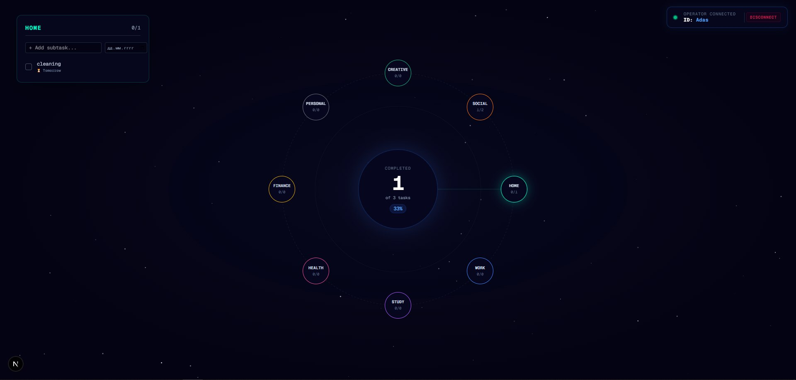
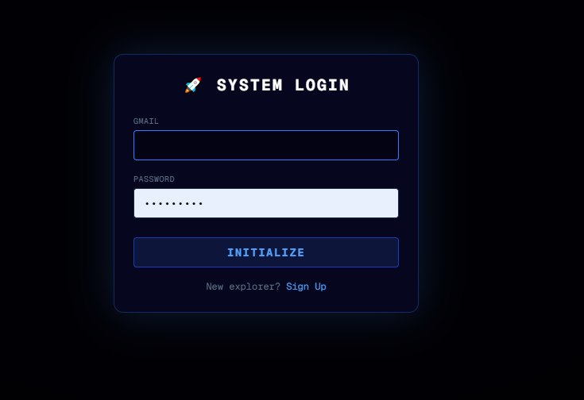
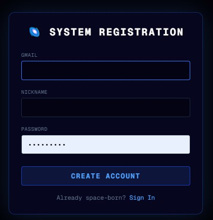

# 🌌 Space Tracker

It's a tracker app with a galaxy-themed design. In this project, the backend is implemented using .NET Web API, and Next.js is responsible for the frontend. PostgreSQL was used as the database.

## 🛠️ Tech Stack

**Frontend:**
* Next.js (React)
* Использовали Tailwind? (Если да, можно дописать)

**Backend & Database:**
* .NET Web API (C#)
* Entity Framework Core
* PostgreSQL

---

## 📱 Screenshots

